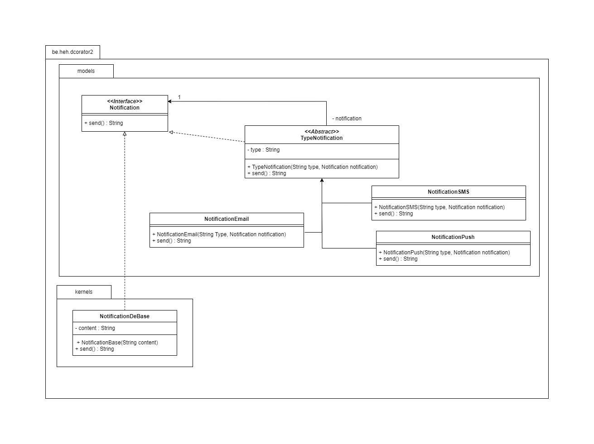

## Exercice 2 : Système de notifications
Dans une application, les notifications peuvent être envoyées de différentes manières :
• Par email
• Par SMS
• Par notification push
Un utilisateur peut choisir une ou plusieurs méthodes de notification. Par exemple, une
notification peut être envoyée par email et SMS en même temps.

Réalisé par EVRARD Kyllian

